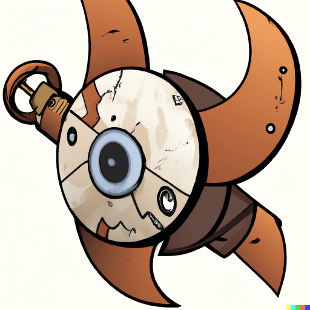

Maghemite - An efficient helper for FHIR® data
==============================================

_(image courtesy of DALL-E)_

License
-------

Copyright 2023 Matthew Willer

Licensed under the [Apache License](./LICENSE.txt), Version 2.0 (the "License");
you may not use files in this repository except in compliance with the License.
You may obtain a copy of the License at

http://www.apache.org/licenses/LICENSE-2.0

Unless required by applicable law or agreed to in writing, software
distributed under the License is distributed on an "AS IS" BASIS,
WITHOUT WARRANTIES OR CONDITIONS OF ANY KIND, either express or implied.
See the License for the specific language governing permissions and
limitations under the License.

FHIR specification Copyright © 2011+ HL7.

The FHIR specification (specifically the set of materials included in the `src/fhir/specification` folder) is produced
by HL7 under the terms of HL7® [Governance and Operations Manual][hl7-govern] relating to Intellectual Property (Section
09, at the time the specification was published), specifically its copyright, trademark and patent provisions.

The FHIR specification is licensed under Creative Commons "No Rights Reserved" ([CC0][cc0]).

HL7®, HEALTH LEVEL SEVEN®, FHIR® and the FHIR [FLAME DESIGN]® are trademarks owned by Health Level Seven International,
registered with the United States Patent and Trademark Office.

[hl7-govern]: http://www.hl7.org/documentcenter/public_temp_4108B35F-1C23-BA17-0C38BD44A97683FB/membership/HL7_Governance_and_Operations_Manual.pdf
[cc0]: http://creativecommons.org/publicdomain/zero/1.0/
